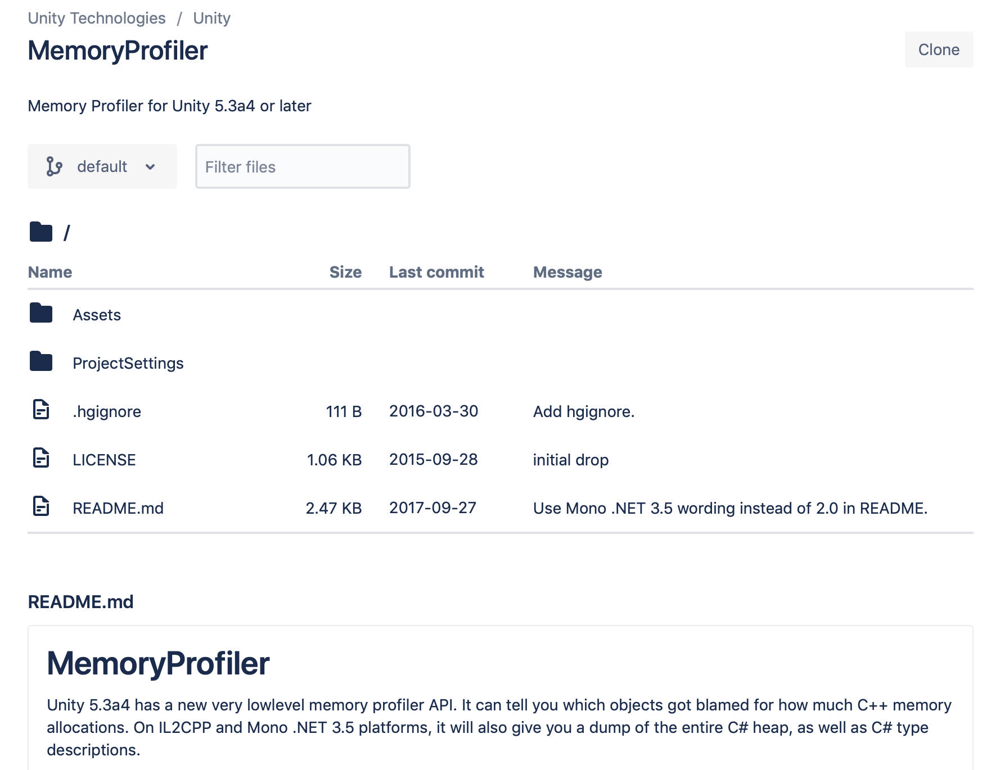

# 前言
Unity3D是个普及度很高拥有大量开发者的游戏开发引擎，其提供的Unity编辑器可以快速的开发移动设备游戏，并且通过编辑器扩展可以很容易开发出项目需要的辅助工具，但是Unity提供性能调试工具非常简陋，功能简单并且难以使用，如果项目出现性能问题，定位起来相当花时间，并且准确率很低，一定程度上靠运气。

> Profiler

目前Unity随包提供的只有Profiler工具，里面聚合CPU、GPU、内存、音频、视频、物理、网络等多个维度的性能数据，但是我们大部分情况下只是用它来定位卡顿问题，也就是主要CPU时间消耗(图\ref{profiler})。


在CPU的维度里面，可以看到当前渲染帧的函数调用层级关系，以及每个函数的时间开销以及调用次数等信息，但是这个工具同一时间只能处理300帧左右的数据，如果游戏帧率30，那么只能看到过去10秒的信息，并且需要我们一直盯着图表看才有机会发现意外的丢帧情况，这种设计非常的不友好，违反正常人的操作习惯，因为通常情况下如果我要调试游戏内战斗过程的性能开销，首先我要像普通玩家那样安安静静的玩一把，而不是分散出大部分精力去看一个只有10秒历史的滚动图表。这种交互带来两个明显的问题，

- 由于分心去看Profiler，导致不能全心投入游戏，从而不能收集正常战斗过程的性能数据
- 为了收集数据需要像正常玩家那样打游戏，不能全神关注Profiler图表，从而不能发现/查看所有的性能问题

上面两个情形相互排斥，鱼与熊掌不可兼得。从这个角度来看，Profiler不是一个好的性能调试工具，苛刻的操作条件导致我们很难发现性能问题，想要通过Profiler定位所有的性能问题简直是痴人说梦。

> MemoryProfiler

Unity还提供另外一个内存分析工具MemoryProfiler(图\ref{mp})


在这个界面的左边彩色区域里，MemoryProfiler按类型占用总内存大小绘制对应面积比例的矩阵图，第一次看到还是蛮酷炫的，Unity是想通过这个矩阵图向开发者提供对象内存检索入口，但是实际使用过程中问题多多。

- 内存分析过程缓慢
- 在众多无差别的小方格里面找到实际关心的资源很难，虽然可以放大缩小，但感觉并没有提升检索的便利性
- 每个对象只提供父级引用关系，无法看到完整的对象引用链，容易在跳转过程中迷失
- 引擎对象的引用和IL2CPP对象的引用混为一谈，让使用者对引用关系的理解模糊不清
- 没有按引擎对象内存和IL2CPP对象内存分类区别统计，加深使用者对内存使用的误解

MemoryProfiler[源码](https://bitbucket.org/Unity-Technologies/memoryprofiler)托管在Bitbucket，但是从最后提交记录来看，这个内存工具已经超过2年半没有任何更新了，但是这期间Unity可是发布了好多个版本，想想就有点后怕。
\
<!--  -->

\

有热心开发者也忍受不了Unity这缓慢的更新节奏，干脆自己动手基于源码在[github](https://github.com/GameBuildingBlocks/PerfAssist)上更新优化，并更改了检索的交互方式。
\
\

不过这也只是在MemoryProfiler的基础上增加检索的便利性，跟理想的检索工具还有很大差距，虽然在内存的类别上做了相对MemoryProfiler更加清晰的区分，但是没有系统化的重构设计，内存分析过程依然异常缓慢，甚至会在分析过程中异常崩溃。
\


# UnityProfiler
## 简介
## 命令手册
### alloc
```c++
const char *basename(const char *filepath)
{
    auto offset = filepath + strlen(filepath);
    const char *upper = nullptr;
    
    while (offset != filepath)
    {
        if (upper == nullptr && *offset == '.') {upper = offset;}
        if (*offset == '/')
        {
            ++offset;
            break;
        }
        --offset;
    }
    
    auto name = &*offset;
    auto size = upper - offset;
    
    char *filename = new char[size + 1];
    memset(filename, 0, size + 1);
    memcpy(filename, name, size);
    return filename;
}
```
### frame
### next
### prev
### stat
### find
### list
### info
### fps
### help
### quit
## 使用案例
### 追踪渲染丢帧
### 追踪动态内存分配
## 小结

# MemoryCrawler
## 简介
## 命令手册
### read
### load
### track
### str
### ref
### uref
### REF
### UREF
### kref
### ukref
### KREF
### UKREF
### link
### ulink
### show
### ushow
### find
### ufind
### type
### utype
### stat
### ustat
### list
### ulist
### bar
### ubar
### heap
### save
### uuid
### help
### quit

## 使用案例
### 检视内存对象
### 追踪内存增长
### 追踪内存泄漏
### 优化Mono内存

## 小结