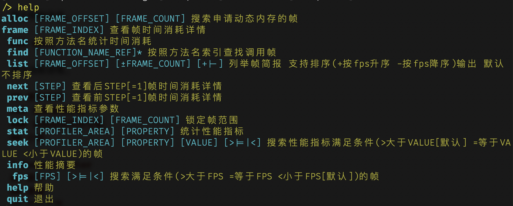
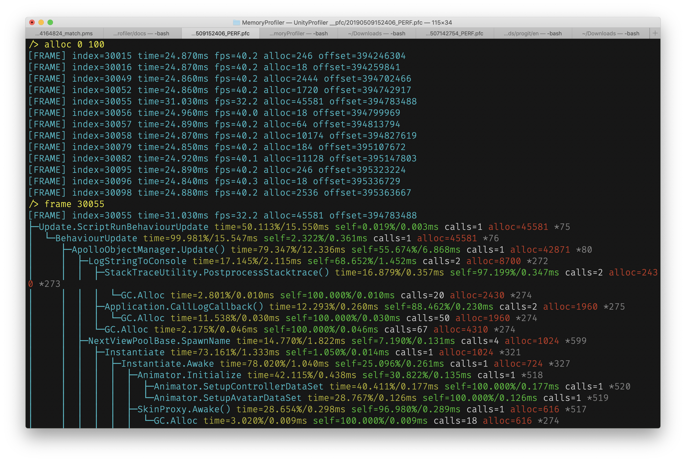
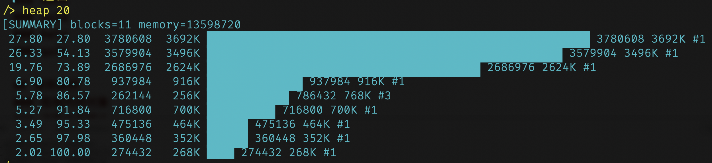

# 前言
*Unity*是个普及度很高拥有大量开发者的游戏开发引擎，其提供的*Unity*编辑器可以快速的开发移动设备游戏，并且通过编辑器扩展可以很容易开发出项目需要的辅助工具，但是*Unity*提供性能调试工具非常简陋，功能简单并且难以使用，如果项目出现性能问题，定位起来相当花时间，并且准确率很低，一定程度上靠运气。

> Profiler

目前Unity随包提供的只有*Profiler*工具，里面聚合*CPU*、*GPU*、内存、音频、视频、物理、网络等多个维度的性能数据，但是我们大部分情况下只是用它来定位卡顿问题，也就是主要*CPU*时间消耗(图\ref{profiler})。


在*CPU*的维度里面，可以看到当前渲染帧的函数调用层级关系，以及每个函数的时间开销以及调用次数等信息，但是这个工具同一时间只能处理**300**帧左右的数据，如果游戏帧率30，那么只能看到过去**10**秒的信息，并且需要我们一直盯着图表看才有机会发现意外的丢帧情况，这种设计非常的不友好，违反正常人的操作习惯，因为通常情况下如果我要调试游戏内战斗过程的性能开销，首先我要像普通玩家那样安安静静的玩一把，而不是分散出大部分精力去看一个只有10秒历史的滚动图表。这种交互带来两个明显的问题，

- 由于分心去看*Profiler*，导致不能全心投入游戏，从而不能收集正常战斗过程的性能数据
- 为了收集数据需要像正常玩家那样打游戏，不能全神关注*Profiler*图表，从而不能发现/查看所有的性能问题

上面两个情形相互排斥，鱼与熊掌不可兼得。从这个角度来看，*Profiler*不是一个好的性能调试工具，苛刻的操作条件导致我们很难发现性能问题，想要通过*Profiler*定位所有的性能问题简直是痴人说梦。

> MemoryProfiler

Unity还提供另外一个内存分析工具MemoryProfiler(图\ref{mp})


在这个界面的左边彩色区域里，*MemoryProfiler*按类型占用总内存大小绘制对应面积比例的矩阵图，第一次看到还是蛮酷炫的，*Unity*是想通过这个矩阵图向开发者提供对象内存检索入口，但是实际使用过程中问题多多。

1. 内存分析过程缓慢
2. 在众多无差别的小方格里面找到实际关心的资源很难，虽然可以放大缩小，但感觉并没有提升检索的便利性
3. 每个对象只提供父级引用关系，无法看到完整的对象引用链，容易在跳转过程中搞错上下文关系
4. 引擎对象的引用和*il2cpp*对象的引用混为一谈，让使用者对引用关系的理解模糊不清
5. 没有按引擎对象内存和*il2cpp*对象内存分类区别统计，加深使用者对内存使用的误解

*MemoryProfiler*[源码](https://bitbucket.org/Unity-Technologies/memoryprofiler)托管在*Bitbucket*，但是从最后提交记录来看，这个内存工具已经超过**2**年半没有任何更新了，但是这期间*Unity*可是发布了好多个版本，想想就有点后怕。
\
\

有热心开发者也忍受不了*Unity*这缓慢的更新节奏，干脆自己动手基于源码在[*github*](https://github.com/GameBuildingBlocks/PerfAssist)上进行优化。
\
\

*PerfAssist*在*MemoryProfiler*源码的基础上做了比较大的更新，主要是增加检索的便利性以及内存快照对比，使用起来比*MemoryProfiler*初代产品方便了不少，但是由于交互界面的限制，也无法完整展示内存引用关系，内存分析过程依然异常缓慢，甚至会在分析过程中异常崩溃。
\

\

鉴于*Unity*性能调试工具现实存在问题，我觉得亟待开发面向开发者、提供更多维度、更高效率的性能调试工具，于是我开发了UnityProfiler和MemoryCrawler两款工具，分别替代*Profiler*以及*MemoryProfiler*进行相同领域的性能调试，这两个款均使用纯*C++*实现，因为经过与*C#*、*Python*对比后发现*C++*有绝对的计算优势，可以非常明显提升性能数据分析效率和稳定性。这两款工具的定位是：降低*Unity*游戏性能调试的门槛，让拥有不同开发经验的开发者都可以轻松定位各种性能问题，尽管都没有可视化交互界面，不过并不影响分析结果的查看，它们都内置命令行模式的交互方式，并提供了丰富的命令，可以对性能数据做全方位的分析定位。


\newpage
# UnityProfiler

## 简介

UnityProfiler以*Unity*引擎自带的*Profiler*工具生成的性能数据为基础，提供多种维度的工具来帮助发现性能问题。该工具前期预研阶段使用*Python*测试逻辑，最终使用*C++*实现。由于是基于*Unity*的原生接口获取数据，所以需要保证*Profiler*工具打开后能看到性能采集界面，真机调试确保按照[官方文档](https://docs.unity3d.com/Manual/ProfilerWindow.html "Profiler Window")正确配置。
\

\

\

## 原理

*Unity*编辑器提供的*Profiler*调试工具，有多个维度的性能数据，我们比较常用的就是查看*CPU*维度的函数调用开销。这个数据可以通过*Unity*未公开的编辑器库
*UnityEditorInternal*来获取，鉴于未公开也谈不上查阅官方文档来获取性能数据采集细节，所以需要通过反编译查看源码才能知道其实现原理：构造类*UnityEditorInternal.ProfilerProperty*对象，调用*GetColumnAsSingle*方法来获取函数调用堆栈相关的性能数据。

```C#
var root = new ProfilerProperty();
root.SetRoot(frameIndex, ProfilerColumn.TotalTime, ProfilerViewType.Hierarchy);
root.onlyShowGPUSamples = false;

var drawCalls = root.GetColumnAsSingle(ProfilerColumn.DrawCalls);
samples.Add(sequence, new StackSample
{
    id = sequence,
    name = root.propertyName,
    callsCount = (int)root.GetColumnAsSingle(ProfilerColumn.Calls),
    gcAllocBytes = (int)root.GetColumnAsSingle(ProfilerColumn.GCMemory),
    totalTime = root.GetColumnAsSingle(ProfilerColumn.TotalTime),
    selfTime = root.GetColumnAsSingle(ProfilerColumn.SelfTime),
});
```

除了函数堆栈方面的开销，*Unity*还有渲染、物理、*UI*、网络等其他维度的数据，这些数据要通过另外一个接口来获取。

```C#
for (ProfilerArea area = 0; area < ProfilerArea.AreaCount; area++)
{
    var statistics = metadatas[(int)area];
    stream.Write((byte)area);
    for (var i = 0; i < statistics.Count; i++)
    {
        var maxValue = 0.0f;
        var identifier = statistics[i];
        ProfilerDriver.GetStatisticsValues(identifier, frameIndex, 1.0f, provider, out maxValue);
        stream.Write(provider[0]);
    }
}
```

本工具基于以上接口把采集到的数据保存为*PFC*格式，该格式为自定义格式，使用了多种算法优化数据存储，比*Unity*编辑器录制的原始数据节省**80%**的存储空间，同时用*C++*语言编写多种维度的性能分析工具，可以高效率地定位卡顿问题。

## 命令手册
### alloc

**alloc** *[frame_offset][=0] [frame_count][=0]*

|参数|可选|描述|
|-|-|-|
|*frame_offset*|是|指定起始帧，相对于当前帧区间第一帧的整形偏移量|
|*frame_count*|是|指定帧数量|

alloc可以在指定的帧区间内搜索所有调用*GC.Alloc*分配内存的渲染帧。

    /> alloc 0 1000 
    [FRAME] index=2 time=23.970ms fps=41.7 alloc=10972 offset=12195
    [FRAME] index=124 time=25.770ms fps=38.8 alloc=184 offset=1326925
    [FRAME] index=127 time=24.870ms fps=40.2 alloc=10972 offset=1359192
    [FRAME] index=250 time=25.740ms fps=38.8 alloc=184 offset=2682771
    [FRAME] index=253 time=24.690ms fps=40.5 alloc=10972 offset=2715142


如果*frame_offset*和*frame_count*留空，alloc将所有可用帧作为参数进行条件搜索。

### info

无参数，查看当前性能录像的基本信息。

```bash
/> info
frames=[1, 44611)=44610 elapse=(1557415446.004, 1557416582.579)=1136.574s fps=39.9±12.8 range=[1.3, 240.6] reasonable=[27.2, 52.5]
```

### frame

**frame** *[frame_index] [stack_depth][=0]*

|参数|可选|描述|
|-|-|-|
|*frame_index*|**否**|指定帧序号|
|*stack_depth*|是|指定函数调用堆栈层级，默认完整堆栈|

frame可以查看指定渲染帧的详细函数调用堆栈信息，见下图。
\

\
在函数堆栈的底部，还有当前帧其他性能指标数据，主要有*CPU、GPU、Rendering、Memory、Audio、Video、Physics、Physics2D、NetworkMessages、NetworkOperations、UI、UIDetails、GlobalIllumination*等13类别，一共77个细分性能指标。
\

\
每次执行frame都会记录当前查询的帧序号，如果所有参数留空，则重复查看当前帧数据。

### next

**next** *[frame_offset][=1]*

|参数|可选|描述|
|-|-|-|
|*frame_offset*|是|相对当前帧的偏移|

next命令相当于按照指定帧偏移量修改当前帧序号同时调用frame命令生成帧数据。

### prev

**prev** *[frame_offset][=1]*

|参数|可选|描述|
|-|-|-|
|*frame_offset*|是|相对当前帧的偏移|

prev命令相当于按照指定帧偏移量修改当前帧序号同时调用frame命令生成帧数据。

### func

**func** *[rank][=0]*

|参数|可选|描述|
|-|-|-|
|*rank*|是|指定显示排行榜前*rank*个数据|

func在当前可用帧区间内，按照函数名统计每个函数的时间消耗，并按照从大到小的顺序排序，*rank*参数可以限定列举范围，默认列举所有函数的时间统计。

	/> func 1
	26.27%   1276.54ms #200     ██████████████████████████ WaitForTargetFPS *1
	/> func 5
	26.27%   1276.54ms #200     ██████████████████████████ WaitForTargetFPS *1
	 6.80%    330.49ms #200     ███████ Profiler.CollectMemoryAllocationStats *128
	 4.31%    209.44ms #1818    ████ RenderForward.RenderLoopJob *7
	 3.89%    188.95ms #909     ████ SceneCulling *25
	 3.11%    151.03ms #9071    ███ WaitForJobGroup *27

第一列表示函数时间消耗百分比，第二列表示时间消耗的总毫秒数，第三列表示函数调用的总次数，最后一列以\*开头的数字表示函数引用。

### find

**find** *[function_ref]*

|参数|可选|描述|
|-|-|-|
|*function_ref*|**否**|指定函数引用|

frame和func命令可以生成以\*开头的数字函数引用，find在当前帧区间内查找调用了指定函数的帧。
\

\

### list

**list** *[frame_offset][=0] [frame_count][=0]*

|参数|可选|描述|
|-|-|-|
|*frame_offset*|是|指定始帧，相对于当前帧区间第一帧的整形偏移量|
|*frame_count*|是|指定帧数量|

list列举指定范围的帧基本信息，如果所有参数留空则列举当前帧区间的所有帧信息。

    /> list 0 10
    [FRAME] index=20000 time=24.900ms fps=40.2 offset=261033153
    [FRAME] index=20001 time=25.230ms fps=39.6 offset=261046018
    [FRAME] index=20002 time=24.530ms fps=40.8 offset=261059203
    [FRAME] index=20003 time=24.840ms fps=40.2 offset=261072356
    [FRAME] index=20004 time=24.880ms fps=40.2 offset=261084797
    [FRAME] index=20005 time=24.900ms fps=40.2 offset=261097310
    [FRAME] index=20006 time=25.270ms fps=39.6 offset=261110143
    [FRAME] index=20007 time=24.470ms fps=40.9 offset=261122944
    [FRAME] index=20008 time=25.340ms fps=39.5 offset=261135865
    [FRAME] index=20009 time=24.400ms fps=41.0 offset=261148698
    [SUMMARY] fps=40.2±1.6 range=[39.5, 41.0] reasonable=[39.5, 41.0]

该工具同时在所有帧数据底部生成*fps*统计数据。

### meta

meta查看性能指标索引，包含*CPU、GPU、Rendering、Memory、Audio、Video、Physics、Physics2D、NetworkMessages、NetworkOperations、UI、UIDetails、GlobalIllumination*等13类别，以及类别属性一共77个细分性能指标，每个性能指标由类别和类别属性两个索引确定，比如*Scripts*由0-1确定，该命令用来为stat和seek提供输入参数。

\
{height=85%}
\

### lock

**lock** *[frame_index][=0] [frame_count][=0]*

|参数|可选|描述|
|-|-|-|
|*frame_index*|是|起始帧序号|
|*frame_count*|是|锁定相对于起始帧的帧数量|

lock参数留空恢复原始帧区间，一旦锁定帧区间，其他除info命令以外的其他命令均在该区间执行相关操作。

    /> lock 10000 20 
    frames=[10000, 10020)
    /> list
    [FRAME] index=10000 time=24.850ms fps=40.2 offset=128440337
    [FRAME] index=10001 time=24.880ms fps=40.2 offset=128453746
    [FRAME] index=10002 time=25.070ms fps=39.9 offset=128467283
    [FRAME] index=10003 time=25.420ms fps=39.3 offset=128480596
    [FRAME] index=10004 time=24.120ms fps=41.4 offset=128494037
    [FRAME] index=10005 time=24.930ms fps=40.1 offset=128507158
    [FRAME] index=10006 time=25.390ms fps=39.4 offset=128520567
    [FRAME] index=10007 time=24.590ms fps=40.7 offset=128533880
    [FRAME] index=10008 time=24.560ms fps=40.7 offset=128547161
    [FRAME] index=10009 time=24.900ms fps=40.2 offset=128560474
    [SUMMARY] fps=40.2±1.9 range=[39.3, 41.4] reasonable=[39.3, 41.4]

### stat

**stat** *[profiler_area] [property]*

|参数|可选|描述|
|-|-|-|
|*profiler_area*|**否**|类别索引，meta命令生成一级索引|
|*property*|**否**|类别属性索引，meta命令生成的二级索引|

stat在当前帧区间按照参数指标进行数学统计，给出99.87%置信区间的边界值，以及均值和标准差信息。

    /> stat 0 1
    [CPU][Scripts] mean=1874400.000±316545.565 range=[1582000, 2965000] 
    reasonable=[1582000, 2269000]

*range*表示当前帧区间*Scripts*时间消耗的最小值和最大值，单位是纳秒[1毫秒=1000000纳秒]，*reasonable*表示按照3倍标准差剔除极大值后的合理取值范围，超出该范围的值应该仔细检查，因为按照统计学在正态分布里面3倍标准差可以覆盖99.87%的数据。

### seek

**seek** *[profiler_area] [property] [value] [predicate][=>]*

|参数|可选|描述|
|-|-|-|
|*profiler_area*|**否**|类别索引，meta命令生成一级索引|
|*property*|**否**|类别属性索引，meta命令生成二级索引|
|*value*|**否**|临界值|
|*predicate*|是|>大于临界值、=等于临界值、<小于临界值三种参数|

seek按照参数确定的指标进行所搜比对，默认列举大于临界值的帧信息，可以通过*predicate*选择大于、等于和小于比对方式进行过滤帧数据。
 
```bash
/> stat 0 1
[CPU][Scripts] mean=1874400.000±316545.565 range=[1582000, 2965000] reasonable=[1582000, 2269000]
/> seek 0 1 2269000
[FRAME] index=10012 time=23.880ms fps=41.9 offset=128599965
```

调用该命令前建议先用stat对性能指标进行简单数学统计，然后根据最大值或者最小值搜索可能存在性能问题的渲染帧。

### fps

**fps** *\[value] [predicate][=>]*


|参数|可选|描述|
|-|-|-|
|*value*|**否**|临界值|
|*predicate*|是|>大于临界值、=等于临界值、<小于临界值三种参数|

    /> fps
    frames=[20000, 20100)=100 fps=40.2±1.2 range=[39.2, 41.5] reasonable=[39.2, 41.2]
    /> fps 41.2 >
    [FRAME] index=20066 time=24.080ms fps=41.5 offset=261880027

当参数留空时，fps统计当前帧区间的帧率信息，指定临界值后，则默认过滤大于临界值的帧数据，可以通过*predicate*选择大于、等于和小于比对方式进行过滤帧数据。

### help

显示帮助信息。

\

\

### quit

退出当前进程。

## 使用案例

### 追踪渲染丢帧

\

\

1. 使用lock锁定大概帧区间[30000, 30000+200)
2. 使用无参数fps对当前帧区间生成针对*fps*统计数据
3. 从数值区间*range=[19.0, 41.8]*可以看出，有渲染帧的*fps*低于阈值20，调用`fps 20`把*fps*值低于20的所有帧列出来，从搜索结果可以看出第**30193**帧的*fps*等于19.0
4. 使用`frame 30193`查看目标帧的详细数据，可以发现当前帧有内存申请操作，并且*InputManager.Update()*函数占用了将近25毫秒的时间，其中*LogStringToConsole(打印日志)*和*GameObject.Activate*占用了大部分时间开销，可以查看更深层级进一步确定时间开销产生细节。

### 追踪动态内存分配

从上面的例子中可以发现动态内存申请会有比较大的时间开销，alloc命令可以快速在指定帧区间进行堆栈搜索，并把所有申请了动态内存的帧数据列出来，方便进一步定位内存产生细节。

\

\

1. 使用`alloc 0 100`列出当前帧区间子区间[0, 100)内有动态内存产生的渲染帧，可以看到**30055**帧产生了比较多的内存。
2. 使用`frame 30055`查看目标帧的详细数据。


## 小结

UnityProfiler以巧妙的方式编码性能数据，节省80%的存储空间，内置多种命令以超高效率在不同维度帮助大家发现性能问题，并快速定位到产生问题的帧，使用该工具可以有效地帮助大家解决卡顿问题，从而提升游戏质量。

# MemoryCrawler
## 简介

MemoryCrawler以*Unity*引擎生成的内存快照数据为基础，提供多种维度的工具来帮助发现内存问题。该工具前期预研阶段使用*Python*测试逻辑，最终使用*C++*实现。由于是基于*Unity*的原生接口获取数据，所以需要保证*Profiler*工具打开后能看到性能采集界面，真机调试确保按照[官方文档](https://docs.unity3d.com/Manual/ProfilerWindow.html "Profiler Window")正确配置。

内存分析是个高计算密度的过程，使用*C#*分析将是个漫长的过程，毕竟是在mono环境运行，MemoryCrawler用*C++*作为开发语言，同时也获得了可观的分析速度，基本在百毫秒级别，也就是眨眼的功夫就完成数据分析，相比*Unity*提供*MemoryProfiler*在内存数据的解析速度、问题定位速度方面都是一个质的飞跃。

## 原理

在命名空间*UnityEditor.MemoryProfiler*有个类*MemorySnapshot*可以请求生成内存快照，一般情况下内存快照创建需要时间，所以需要侦听*MemorySnapshot.OnSnapshotReceived*事件，拿到内存数据就可以做相关的内存分析了。

```C#
MemorySnapshot.OnSnapshotReceived += OnSnapshotComplete;
MemorySnapshot.RequestNewSnapshot();

private static void OnSnapshotComplete(PackedMemorySnapshot snapshot)
{
    MemorySnapshot.OnSnapshotReceived -= OnSnapshotComplete;
    ExportMemorySnapshot(snapshot, false);
}
```

## 命令手册
### read

**read** *[uuid]*


|参数|可选|描述|
|-|-|-|
|*uuid*|是|每个内存快照都有一个唯一16字节36字符的*uuid*|

read加载缓存在*sqlite*里面的内存快照分析结果，*uuid*为原始内存快照的标识符，使用read的前提是存在相应的缓存文件，通过uuid命令可以查看快照的*uuid*。如果*uuid*留空则，加载当前内存快照的缓存文件。read加载完缓存后，会自动与当前内存快照做差异分析。

### load

**load** *[pms_filepath]*

|参数|可选|描述|
|-|-|-|
|*pms_filepath*|**否**|内存快照路径|

load从原始内存快照文件加载内存数据并进行内存分析，其他功能与read相同，会自动与当前内存快照做差异分析。

### track

**track** *[tracking_mode]*

|参数|可选|描述|
|-|-|-|
|*tracking_mode*|是|内存追踪模式 *alloc*=内存增长追踪模式 *leak*=内存泄漏追踪模式 *?*=查看当前模式|

使用read或load加载完另外一个内存快照后，会自动与当前内存快照做内存差异分析，设置追踪模式可以方便地在差异内存里面定位内存问题。*tracking_mode*留空时则清除当前追踪模式。

    /> read e4a5b509-f9cc-a84e-9f90-c502a54fe76e
    [0] SnapshotCrawlerCache=19492135
        [1] SnapshotCrawlerCache::read=19490006
            [2] open=1400984
            [3] read_PackedMemorySnapshot=9540012
                [4] read_native_types=450704
                [5] read_native_objects=2932726
                [6] read_managed_types=6111619
                    [7] read_type_fields=802478
                [8] read_vm=42409
            [9] read_MemorySnapshotCrawler=8371204
                [10] read_managed_objects=8370010
    /> track alloc
    ENTER TRACKING ALLOC MODE
    /> track ?
    ENTER TRACKING ALLOC MODE
    /> track leak
    ENTER TRACKING LEAK MODE
    /> track
    LEAVE TRACKING MODE

### str

**str** *[address]*

|参数|可选|描述|
|-|-|-|
|*address*|**否**|字符串对象的内存地址|

```C#
/> str 3106572216
0xb92a87b8 130 '很遗憾，我们现在无法向您继续提供服务。我们的数据存储在EEA地区之外，为了为您提供服务我们的支持团队必须从其他司法管辖区访问数据。'
```
第一列参数为字符串地址的16进制形式，第二列为字符串占用内存大小，第三列为字符串内容。
\pagebreak

### ref

**ref** *[address]*

|参数|可选|描述|
|-|-|-|
|*address*|**否**|对象的内存地址|

查找保持当前对象在内存中活跃的关系链，使用递归遍历父级引用关系，但是每层递归最多产生两个分支，因为对象在内存中的引用关系有可能很复杂，导致递归深度过大而耗用过多电脑内存以及过多的关系链。通常我们理想的引用关系是下图这样的，深度有限，引用简单。
\
\
\
{width=40%}\ {width=50%}

\pagebreak
但实际上每一层递归节点都有可能产生很多递归分支，导致遍历节点异常庞大，所以ref做了对每层递归分支数量做了限制，这样哪怕对象引用关系很复杂的情况下也可以得到部分引用关系，下图只是每层递归2个分支一共9层递归的模型，实际的引用树状图可能无法用图来描绘出来。
<br /> <br /> <br /> <br /> <br />
<br /> <br /> <br /> <br /> <br />
\
\
\

\
ref接受一个内存地址参数，可以自动识别八进制、十进制以及十六进制，*3106572216*为上个例子中的字符串地址。
```c#
/> ref 3106572216
<GCHandle>::ApplicationTranslator 0xebb97d20
    .{database:translation_protocol.TranslationContainer} 0xc085f460
    .{_clases:System.Collections.Generic.List<translation_protocol.ClassContainer>} 0xe37d7f00
    .{_items:translation_protocol.ClassContainer}[8] 0xb9153018
    .{_fields:System.Collections.Generic.List<translation_protocol.LocalizedItem>} 0xb9153000
    .{_items:translation_protocol.LocalizedItem}[0] 0xb91c55e0
    .{_text:System.String} 0xb92a87b8
<Static>::dataconfig.DataConfigManager::{dataObserver:dataconfig.DataConfigObserver} 0xd361bf18
    .{prev:dataconfig.DataConfigObserver} 0xd361bee0
    .{m_target:ApplicationTranslator} 0xebb97d20
    .{database:translation_protocol.TranslationContainer} 0xc085f460
    .{_clases:System.Collections.Generic.List<translation_protocol.ClassContainer>} 0xe37d7f00
    .{_items:translation_protocol.ClassContainer}[8] 0xb9153018
    .{_fields:System.Collections.Generic.List<translation_protocol.LocalizedItem>} 0xb9153000
    .{_items:translation_protocol.LocalizedItem}[0] 0xb91c55e0
    .{_text:System.String} 0xb92a87b8
<Static>::ApplicationTranslator::{_shared:ApplicationTranslator} 0xebb97d20
    .{database:translation_protocol.TranslationContainer} 0xc085f460
    .{_clases:System.Collections.Generic.List<translation_protocol.ClassContainer>} 0xe37d7f00
    .{_items:translation_protocol.ClassContainer}[8] 0xb9153018
    .{_fields:System.Collections.Generic.List<translation_protocol.LocalizedItem>} 0xb9153000
    .{_items:translation_protocol.LocalizedItem}[0] 0xb91c55e0
    .{_text:System.String} 0xb92a87b8
<Static>::HardStrings.LaunchStart::{TIPS_REJECT_DATA_POLICY:System.String} 0xb92a87b8
```
在这个例子中，可以看出*3106572216*有四个引用关系，第一个引用被*Unity*的*GCHandle*，其他三个分别被静态对象引用，引用的终点和当前对象之间为引用链经过的对象路径，每一个对象节点都有清晰的变量名以及对象地址。
\pagebreak

### REF

**REF** *[address]*

|参数|可选|描述|
|-|-|-|
|*address*|**否**|对象的内存地址|

同ref相同，REF列举保持对象在内存中活跃的关系链，不同的是REF尝试遍历所有的引用关系，如果遇到引用关系复杂，递归深度比较大的情况下，会采用递归总量限制保证REF在合理的内存开销下列举尽可能多的关系链，对于没有递归到终点的关系链会用星号\*标记。对于复杂对象，可能会产生大量的引用链，会花费比较长的时间打印关系链结果。

|引用标记|说明|
|-|-|-|
|*GCHandle*|表示对象最终被*Unity*的*GCHandle*管理器引用，如果这是对象仅有的引用，*Unity*会在合适的时机自动释放|
|*Static*|表示对象被静态类引用|
|星号|表示递归深度过大，当前引用链被中断|
|∞|表示对象被环式引用|

### uref

**uref** *[address]*

|参数|可选|描述|
|-|-|-|
|*address*|**否**|对象的内存地址|

列举*Unity*引擎创建的*native*对象引用关系链，与ref对应，使用有限递归分支列举部分引用关系链。

    /> uref 3269982224
    <SIS>.{Sprite:0xcd2a8ad0:'mu'}.{Texture2D:0xc2e7f810:'Country_RGB'} 
    <SIS>.{Sprite:0xcd2a7950:'ml'}.{Texture2D:0xc2e7f810:'Country_RGB'} 

|引用标记|说明|
|-|-|-|
|*SIS*|*Store In Scene*|
|*DDO*|*Dont't Destry Object*|
|*UMO*|*Unity Manager Object*|
|星号|表示递归深度过大，当前引用链被中断|
|∞|表示对象被环式引用|

### UREF

**UREF** *[address]*

|参数|可选|描述|
|-|-|-|
|*address*|**否**|对象的内存地址|

同REF类似，但是遍历引擎对象的所有引用关系链。

    /> UKREF 3269982224
    <SIS>.{Sprite:0xcd2a8ad0:'mu'}.{Texture2D:0xc2e7f810:'Country_RGB'} 
    <SIS>.{Sprite:0xcd2a7950:'ml'}.{Texture2D:0xc2e7f810:'Country_RGB'} 
    <SIS>.{Sprite:0xcd373b50:'br'}.{Texture2D:0xc2e7f810:'Country_RGB'} 
    <SIS>.{Sprite:0xcd2c8fd0:'sa'}.{Texture2D:0xc2e7f810:'Country_RGB'} 
    <SIS>.{Sprite:0xcd3ebad0:'ao'}.{Texture2D:0xc2e7f810:'Country_RGB'} 
    <SIS>.{Sprite:0xcd2c94d0:'sc'}.{Texture2D:0xc2e7f810:'Country_RGB'} 
    <SIS>.{Sprite:0xcd2906d0:'gb'}.{Texture2D:0xc2e7f810:'Country_RGB'} 
    <SIS>.{Sprite:0xcd2c5650:'no'}.{Texture2D:0xc2e7f810:'Country_RGB'} 
    <SIS>.{Sprite:0xcd375590:'cg'}.{Texture2D:0xc2e7f810:'Country_RGB'} 
    <SIS>.{Sprite:0xcd2a7e50:'mn'}.{Texture2D:0xc2e7f810:'Country_RGB'} 
    <SIS>.{Sprite:0xcd29a0d0:'ki'}.{Texture2D:0xc2e7f810:'Country_RGB'} 
    <SIS>.{Sprite:0xcd2a8d50:'mv'}.{Texture2D:0xc2e7f810:'Country_RGB'} 
    <SIS>.{Sprite:0xcd299e50:'kh'}.{Texture2D:0xc2e7f810:'Country_RGB'} 
    <SIS>.{Sprite:0xcd2c6550:'pa'}.{Texture2D:0xc2e7f810:'Country_RGB'} 
    <SIS>.{Sprite:0xcd2dd2d0:'ws'}.{Texture2D:0xc2e7f810:'Country_RGB'} 
    <SIS>.{Sprite:0xcd377d90:'dm'}.{Texture2D:0xc2e7f810:'Country_RGB'} 
    <SIS>.{Sprite:0xcd2a7450:'mh'}.{Texture2D:0xc2e7f810:'Country_RGB'} 
    <SIS>.{Sprite:0xcd2c6cd0:'pg'}.{Texture2D:0xc2e7f810:'Country_RGB'} 
    <SIS>.{Sprite:0xcd3eb350:'ag'}.{Texture2D:0xc2e7f810:'Country_RGB'} 
    <SIS>.{Sprite:0xcd2d7ed0:'uz'}.{Texture2D:0xc2e7f810:'Country_RGB'} 
    <SIS>.{Sprite:0xcd2d4550:'sv'}.{Texture2D:0xc2e7f810:'Country_RGB'} 

### kref

**kref** *[address]*

|参数|可选|描述|
|-|-|-|
|*address*|**否**|对象的内存地址|

同ref功能相同，但是剔除`*`和`∞`开头的关系链，在数据量比较大的情况下会比较有用。

### KREF

**KREF** *[address]*

|参数|可选|描述|
|-|-|-|
|*address*|**否**|对象的内存地址|

同REF功能相同，但是剔除`*`和`∞`开头的关系链，在数据量比较大的情况下会比较有用。

### ukref

**ukref** *[address]*

|参数|可选|描述|
|-|-|-|
|*address*|**否**|对象的内存地址|

同uref功能相同，但是剔除`*`和`∞`开头的关系链，在数据量比较大的情况下会比较有用。

### UKREF

**UKREF** *[address]*

|参数|可选|描述|
|-|-|-|
|*address*|**否**|对象的内存地址|

同UREF功能相同，但是剔除`*`和`∞`开头的关系链，在数据量比较大的情况下会比较有用。

### link

**link** *[address]*

|参数|可选|描述|
|-|-|-|
|*address*|**否**|对象的内存地址|

对于继承于*UnityEngine.Object*类的对象，可以使用该命令查看对应的*native*引擎对象地址，可以方便在不同的内存空间进行审视对象内存。

    /> link 3816674832
    3269982224
    /> uref 3269982224
    <SIS>.{Sprite:0xcd2a8ad0:'mu'}.{Texture2D:0xc2e7f810:'Country_RGB'} 
    <SIS>.{Sprite:0xcd2a7950:'ml'}.{Texture2D:0xc2e7f810:'Country_RGB'} 

### ulink

**ulink** *[address]*

|参数|可选|描述|
|-|-|-|
|*address*|**否**|对象的内存地址|

使用该命令查看*native*引擎对象对应的*il2cpp*对象，可以方便在不同的内存空间进行审视对象内存。

    /> ulink 3269982224
    3816674832
    /> ref 3816674832
    <GCHandle>::UnityEngine.Texture2D 0xe37dd610

### show

**show** *[address]*

|参数|可选|描述|
|-|-|-|
|*address*|**否**|对象的内存地址|

```C#
/> show 3495241968
System.String 0xd05528f0
├─length:System.Int32 = 42
└─start_char:System.Char = \u5411
/> show 0xb8fb00e0
translation_protocol.LocalizedItem 0xb8fb00e0
├─_sid:System.String = NULL
├─_uid:System.Nullable<System.UInt32>
│  ├─value:System.UInt32 = 200160
│  └─has_value:System.Boolean = true
├─_text:System.String 0xd05528f0 = '向四周瞬间投出大量的魔刃，对周围半径3格的敌人造成175/225/275点魔法伤害。'
└─extensionObject:ProtoBuf.IExtension = NULL
```

### ushow

**ushow** *[address]*

|参数|可选|描述|
|-|-|-|
|*address*|**否**|对象的内存地址|

该命令用来查看当前*native*引擎对象内部保持的引用关系链。

```C#
/> ushow 0xbcbff110
'LanguageSelect':GameObject 0xbcbff110
└─'NameTxt2':GameObject 0xb9b8a450=144
   └─'LocalIEFlag':MonoScript 0xc2fa3610=244
```

### find

**find** *[address]*

|参数|可选|描述|
|-|-|-|
|*address*|**否**|对象的内存地址|

find查看*il2cpp*对象并展示相关信息。

```C#
/> find 0xb8fe1ec0
0xb8fe1ec0 type='translation_protocol.LocalizedItem'1614 size=28 assembly='ProtobufProtocol'
```
对象类型名之后的数字**1614**为对象类型引用，可以使用type命令查看类型信息。

### ufind

**ufind** *[address]*

|参数|可选|描述|
|-|-|-|
|*address*|**否**|对象的内存地址|

ufind查看*native*引擎对象并展示相关信息。

```C#
/> ufind 3266512656
0xc2b30710 name='INetworkService' type='MonoScript'158 size=244
```
对象类型名之后的数字**158**为对象类型引用，可以使用utype命令查看类型信息。

### type

**type** *[type_ref]*

|参数|可选|描述|
|-|-|-|
|*type_ref*|**否**|*il2cpp*类型引用|

type查看*il2cpp*类型信息，通过find、stat、bar可以得到类型引用。

```C#
/> type 1614
0xbba39b40 name='translation_protocol.LocalizedItem'1614 size=28 baseOrElementType='System.Object'0 assembly='ProtobufProtocol' instanceMemory=329420 instanceCount=11765
    isStatic=false name='_sid' offset=8 typeIndex=23
    isStatic=false name='_uid' offset=12 typeIndex=3520
    isStatic=false name='_text' offset=20 typeIndex=23
    isStatic=false name='extensionObject' offset=24 typeIndex=617
```

### utype

**utype** *[type_ref]*

|参数|可选|描述|
|-|-|-|
|*type_ref*|**否**|*native*引擎类型引用|

utype查看*native*引擎类型信息，通过ufind、ustat、ubar可以得到类型引用。

```C#
/> utype 158
name='MonoScript'158 nativeBaseType='TextAsset'156 instanceMemory=812217 instanceCount=3087
```

### stat

**stat** *[rank][=5]*

|参数|可选|描述|
|-|-|-|
|*rank*|是|限定*il2cpp*类型实例显示数量|

stat按照*il2cpp*类型为分组，列举每个类型内存占用前*rank*名的实例对象信息，按照类型总内存从小到大排序。

    /> stat
    ┌────────────────────────────────────────
    │ [System.Byte] memory=2 type_index=15
    │ 0x00000000      1 System.Byte
    │ 0x00000010      1 System.Byte
    ├────────────────────────────────────────
    │ [System.Char] memory=4 type_index=22
    │ 0x00000000      2 System.Char
    │ 0x00000008      2 System.Char
    ├────────────────────────────────────────
    │ [DG.Tweening.LogBehaviour] memory=4 type_index=1195
    │ 0x00000008      4 DG.Tweening.LogBehaviour
    ├────────────────────────────────────────
    │ [LogSeverity] memory=4 type_index=2103
    │ 0x0000002c      4 LogSeverity
    ├────────────────────────────────────────
    │ [TheNextMoba.Module.Arena.ArenaPlayMode] memory=4 type_index=2199
    │ 0x00000004      4 TheNextMoba.Module.Arena.ArenaPlayMode

### ustat

**ustat** *[rank][=5]*

|参数|可选|描述|
|-|-|-|
|*rank*|是|限定*native*引擎类型实例显示数量|

ustat按照*native*引擎类型为分组，列举每个类型内存占用前*rank*名的实例对象信息，按照类型总内存从小到大排序。

    /> ustat
    ┌────────────────────────────────────────
    │ [Texture2DArray] memory=4 type_index=170
    │ 0xc8384a50       4 'UnityDefault2DArray'
    ├────────────────────────────────────────
    │ [NavMeshSettings] memory=48 type_index=200
    │ 0xc9920c10      48 'NavMeshSettings'
    ├────────────────────────────────────────
    │ [GUILayer] memory=52 type_index=42
    │ 0xcdbd5060      52 'UICamera'
    ├────────────────────────────────────────
    │ [DelayedCallManager] memory=76 type_index=179
    │ 0xcdab4ea0      76 'DelayedCallManager'
    ├────────────────────────────────────────
    │ [MeshFilter] memory=104 type_index=94
    │ 0xc4abe8c0      52 'glow'
    │ 0xbb61b9e0      52 'glow'

### list

**list** *[type_ref]*

|参数|可选|描述|
|-|-|-|
|*type_ref*|**否**|*il2cpp*类型引用|

list列举*type_ref*指定*il2cpp*类型的所有实例对象信息，该命令的结果受*track*设置影响。

    /> list 2904
    [dataconfig.BAG_ITEM_CONF[]][=] memory=288
    0xebb91360       16 dataconfig.BAG_ITEM_CONF[]
    0xebb8d260      272 dataconfig.BAG_ITEM_CONF[]
    [SUMMARY] count=2 memory=288

### ulist

**ulist** *[type_ref]*

|参数|可选|描述|
|-|-|-|
|*type_ref*|**否**|排行榜数量|

ulist列举*type_ref*指定*native*引擎类型的所有实例对象信息，该命令的结果受*track*设置影响。

    /> ulist 156
    [TextAsset][=] memory=1090701
    0xce55af30      113 'dataconfig_mode_sub_type_conf'
    0xce559b80      519 'dataconfig_msg_language_conf'
    0xce55ac20   103555 'ja_JP_language'
    0xce55aa60   125146 'en_US_language'
    0xce5598e0   128359 'ru_RU_language'
    0xce557ce0   140676 'zh_Hant_TW_language'
    0xb1584010   592333 'zh_Hans_CN_language'
    [SUMMARY] count=7 memory=1090701

### bar

**bar** *[rank]*

|参数|可选|描述|
|-|-|-|
|*rank*|**否**|排行榜数量|

bar按照*il2cpp*类型进行内存统计，并打印前*rank*的类型内存分配信息，该命令的结果受*track*设置影响。

```
/> bar 5
 21.73  21.73 ██████████████████████ System.String 1523764 #17554 *23
 16.35  38.08 ████████████████ UnityEngine.UIVertex[] 1146656 #473 *2742
 16.24  54.32 ████████████████ UnityEngine.UIVertex 1139164 #14989 *537
  5.95  60.26 ██████ UnityEngine.Vector3 416952 #34746 *442
  4.70  64.96 █████ translation_protocol.LocalizedItem 329420 #11765 *1614
```

第一列为当前类型占用总内存的百分比，第二列为排行榜累积百分比，第三列为类型名，第四列为类型占用内存字节数，以#开头的第五列为当前类型的实例数量，以星号\*开头的数字为类型引用。

### ubar

**ubar** *[rank]*

|参数|可选|描述|
|-|-|-|
|*rank*|**否**|排行榜数量|

ubar按照*native*引擎类型进行内存统计，并打印前*rank*的类型内存分配信息，该命令的结果受*track*设置影响。

```
/> ubar 5
 41.18  41.18 █████████████████████████████████████████ Font 16161642 #9 *132
 34.08  75.26 ██████████████████████████████████ Texture2D 13373919 #133 *168
 11.94  87.20 ████████████ ResourceManager 4683935 #1 *191
  2.78  89.97 ███ TextAsset 1090701 #7 *156
  2.56  92.54 ███ MonoBehaviour 1005039 #2102 *63
```

第一列为当前类型占用总内存的百分比，第二列为排行榜累积百分比，第三列为类型名，第四列为类型占用内存字节数，以#开头的第五列为当前类型的实例数量，以星号\*开头的数字为类型引用。

### heap

显示当前堆内存信息。
\
\

\

### save

把当前内存快照的分析结果保存为*sqlite*格式。

```
/> save
[0] SnapshotCrawlerCache=222266990
    [1] SnapshotCrawlerCache::save=222263272
        [2] open=6161533
        [3] create_native_types=1428120
        [4] create_native_objects=1240330
        [5] create_managed_types=851252
        [6] create_type_fields=1380078
        [7] create_objects=832663
        [8] insert_native_types=2176337
        [9] insert_native_objects=12473052
        [10] insert_managed_types=18660698
        [11] remove_redundants=35515270
        [12] insert_objects=114539829
        [13] insert_vm=1615608
        [14] insert_strings=24375049
```

### uuid

显示当前内存快照的唯一标识符。

    /> uuid
    4da88f70-5539-a848-afae-bef6c93fd7f4

### help

显示帮助。

```
/> help
 read [UUID]* 读取以sqlite3保存的内存快照缓存
 load [PMS_FILE_PATH]* 加载内存快照文件
track [alloc|leak] 追踪内存增长以及泄露问题
  str [ADDRESS]* 解析地址对应的字符串内容
  ref [ADDRESS]* 列举保持IL2CPP对象内存活跃的引用关系
 uref [ADDRESS]* 列举保持引擎对象内存活跃的引用关系
  REF [ADDRESS]* 列举保持IL2CPP对象内存活跃的全量引用关系
 UREF [ADDRESS]* 列举保持引擎对象内存活跃的全量引用关系
 kref [ADDRESS]* 列举保持IL2CPP对象内存活跃的引用关系并剔除干扰项
ukref [ADDRESS]* 列举保持引擎对象内存活跃的引用关系并剔除干扰项
 KREF [ADDRESS]* 列举保持IL2CPP对象内存活跃的全量引用关系并剔除干扰项
UKREF [ADDRESS]* 列举保持引擎对象内存活跃的全量引用关系并剔除干扰项
 link [ADDRESS]* 查看与IL2CPP对象链接的引擎对象
ulink [ADDRESS]* 查看与引擎对象链接的IL2CPP对象
 show [ADDRESS]* 查看IL2CPP对象内存排布以及变量值
ushow [ADDRESS]* 查看引擎对象内部的引用关系
 find [ADDRESS]* 查找IL2CPP对象
ufind [ADDRESS]* 查找引擎对象
 type [TYPE_INDEX]* 查看IL2CPP类型信息
utype [TYPE_INDEX]* 查看引擎类型信息
 stat [RANK] 按类型输出IL2CPP对象内存占用前RANK名的简报[支持内存追踪过滤]
ustat [RANK] 按类型输出引擎对象内存占用前RANK名的简报[支持内存追踪过滤]
  bar [RANK] 输出IL2CPP类型内存占用前RANK名图形简报[支持内存追踪过滤]
 ubar [RANK] 输出引擎类型内存占用前RANK名图形简报[支持内存追踪过滤]
 list 列举IL2CPP类型所有活跃对象内存占用简报[支持内存追踪过滤]
ulist 列举引擎类型所有活跃对象内存占用简报[支持内存追踪过滤]
 heap [RANK] 输出动态内存简报
 save 把当前内存快照分析结果以sqlite3格式保存到本机
 uuid 查看内存快照UUID
 help 帮助
 quit 退出
 ```

### quit

退出当前内存快照分析。

## 使用案例
### 追踪内存增长
### 追踪内存泄漏
### 优化Mono内存

## 小结