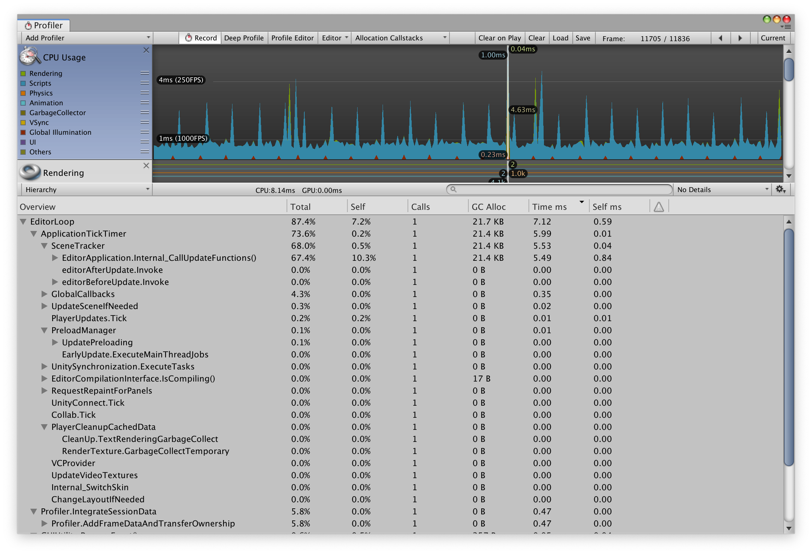
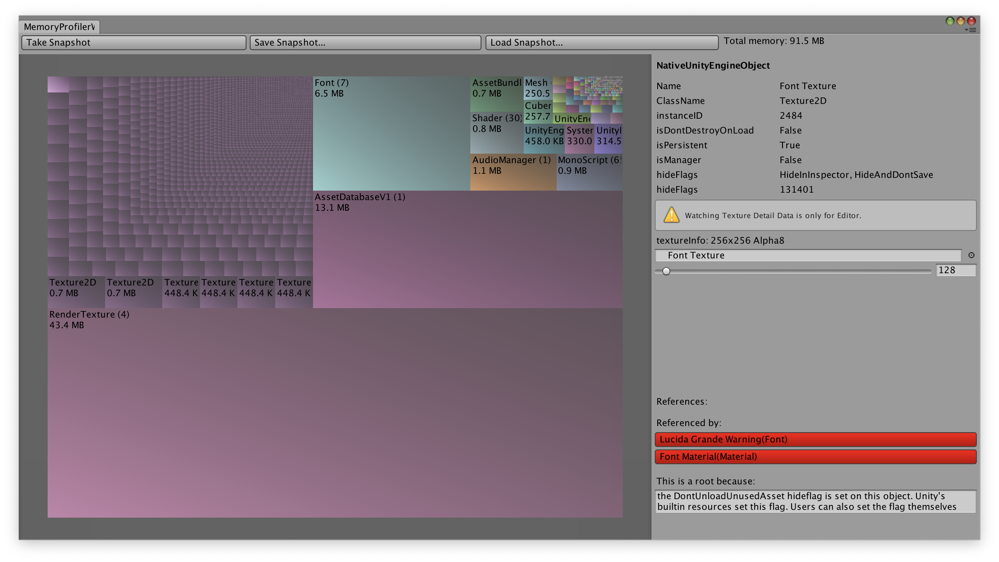
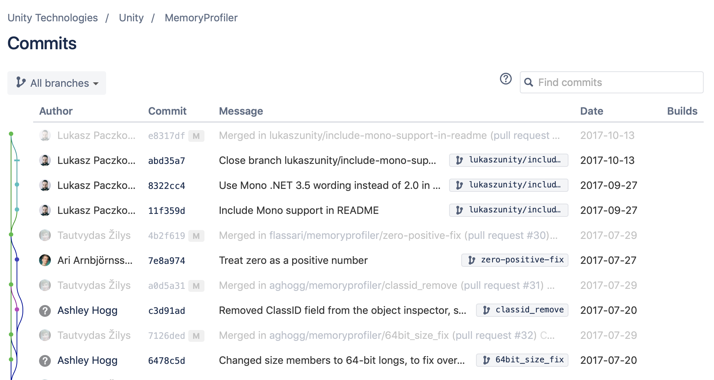
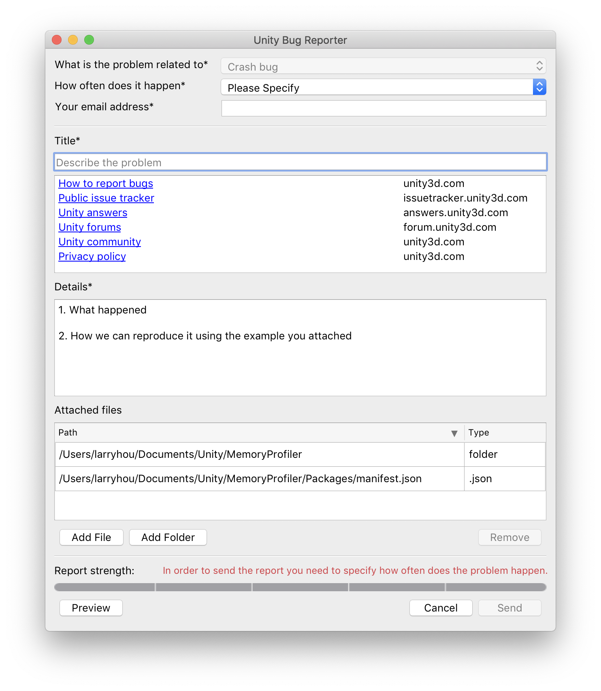
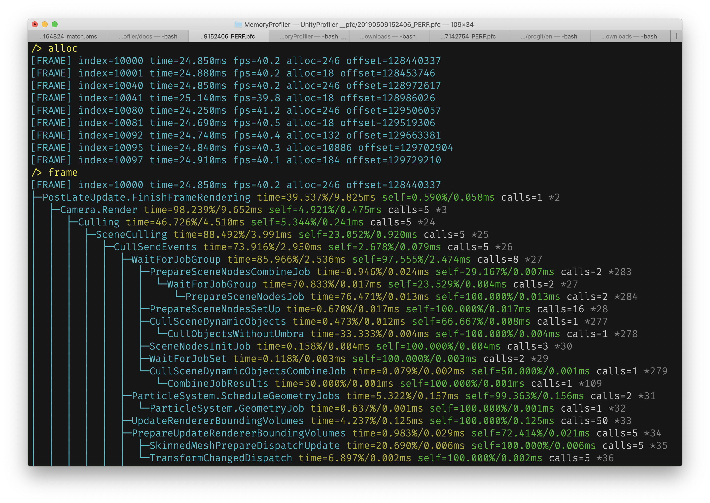
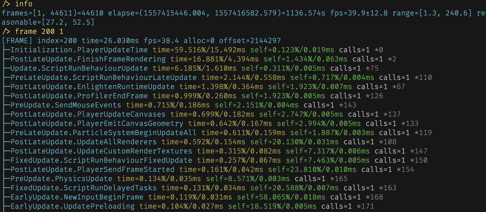
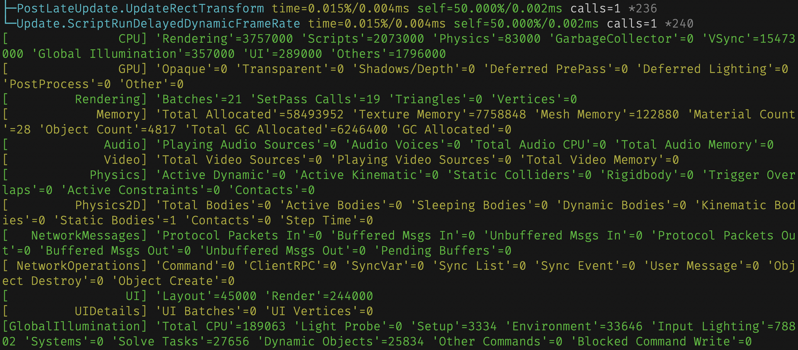
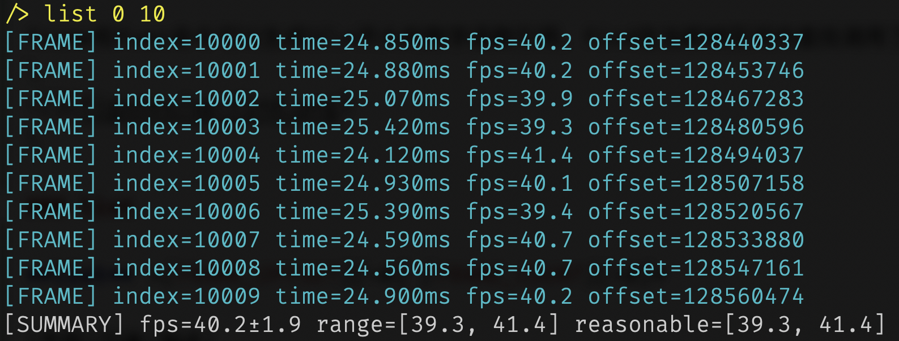
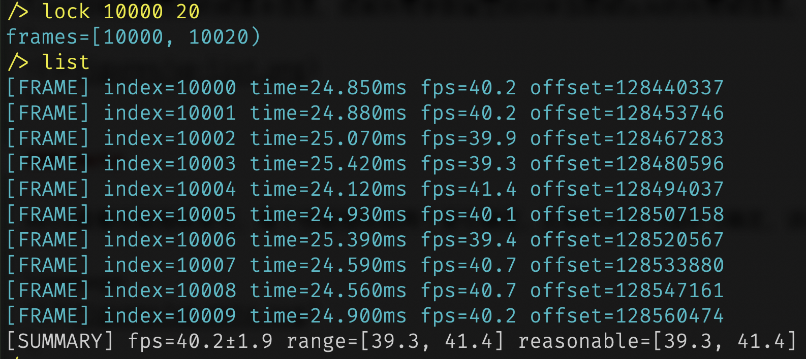

# 前言
Unity3D是个普及度很高拥有大量开发者的游戏开发引擎，其提供的Unity编辑器可以快速的开发移动设备游戏，并且通过编辑器扩展可以很容易开发出项目需要的辅助工具，但是Unity提供性能调试工具非常简陋，功能简单并且难以使用，如果项目出现性能问题，定位起来相当花时间，并且准确率很低，一定程度上靠运气。

> Profiler

目前Unity随包提供的只有Profiler工具，里面聚合CPU、GPU、内存、音频、视频、物理、网络等多个维度的性能数据，但是我们大部分情况下只是用它来定位卡顿问题，也就是主要CPU时间消耗(图\ref{profiler})。



在CPU的维度里面，可以看到当前渲染帧的函数调用层级关系，以及每个函数的时间开销以及调用次数等信息，但是这个工具同一时间只能处理300帧左右的数据，如果游戏帧率30，那么只能看到过去10秒的信息，并且需要我们一直盯着图表看才有机会发现意外的丢帧情况，这种设计非常的不友好，违反正常人的操作习惯，因为通常情况下如果我要调试游戏内战斗过程的性能开销，首先我要像普通玩家那样安安静静的玩一把，而不是分散出大部分精力去看一个只有10秒历史的滚动图表。这种交互带来两个明显的问题，

- 由于分心去看Profiler，导致不能全心投入游戏，从而不能收集正常战斗过程的性能数据
- 为了收集数据需要像正常玩家那样打游戏，不能全神关注Profiler图表，从而不能发现/查看所有的性能问题

上面两个情形相互排斥，鱼与熊掌不可兼得。从这个角度来看，Profiler不是一个好的性能调试工具，苛刻的操作条件导致我们很难发现性能问题，想要通过Profiler定位所有的性能问题简直是痴人说梦。

> MemoryProfiler

Unity还提供另外一个内存分析工具MemoryProfiler(图\ref{mp})



在这个界面的左边彩色区域里，MemoryProfiler按类型占用总内存大小绘制对应面积比例的矩阵图，第一次看到还是蛮酷炫的，Unity是想通过这个矩阵图向开发者提供对象内存检索入口，但是实际使用过程中问题多多。

- 内存分析过程缓慢
- 在众多无差别的小方格里面找到实际关心的资源很难，虽然可以放大缩小，但感觉并没有提升检索的便利性
- 每个对象只提供父级引用关系，无法看到完整的对象引用链，容易在跳转过程中迷失
- 引擎对象的引用和IL2CPP对象的引用混为一谈，让使用者对引用关系的理解模糊不清
- 没有按引擎对象内存和IL2CPP对象内存分类区别统计，加深使用者对内存使用的误解

MemoryProfiler[源码](https://bitbucket.org/Unity-Technologies/memoryprofiler)托管在Bitbucket，但是从最后提交记录来看，这个内存工具已经超过2年半没有任何更新了，但是这期间Unity可是发布了好多个版本，想想就有点后怕。
\
\

有热心开发者也忍受不了Unity这缓慢的更新节奏，干脆自己动手基于源码在[github](https://github.com/GameBuildingBlocks/PerfAssist)上更新优化，并更改了检索的交互方式。
\
\

不过这也只是在MemoryProfiler的基础上增加检索的便利性，跟理想的检索工具还有很大差距，虽然在内存的类别上做了相对MemoryProfiler更加清晰的区分，但是没有系统化的重构设计，内存分析过程依然异常缓慢，甚至会在分析过程中异常崩溃。
\

\

```c#
namespace MemoryProfilerWindow
{
    static class ManagedHeapExtensions
    {
        public static BytesAndOffset Find(this MemorySection[] heap, UInt64 address, 
            VirtualMachineInformation virtualMachineInformation)
        {
            foreach (var segment in heap)
            {
                if (address >= segment.startAddress 
                    && address < (segment.startAddress + (ulong) segment.bytes.Length))
                {
                    return new BytesAndOffset() 
                        { 
                            bytes = segment.bytes,
                            offset = (int)(address - segment.startAddress), 
                            pointerSize = virtualMachineInformation.pointerSize
                        };
                }
                
            }

            return new BytesAndOffset();
        }
    }
}
```

\newpage

# UnityProfiler

## 简介

UnityProfiler以Unity引擎自带的Profiler工具生成的性能数据为基础，提供多种维度的工具来帮助发现性能问题。该工具前期预研阶段使用Python测试逻辑，最终使用C++实现，这样可以利用C++的强大计算能力来提升解析速度，提高性能分析效率。由于是基于Unity的原生接口获取数据，所以需要保证Profiler工具打开后能看到性能采集界面，真机调试确保按照[官方文档](https://docs.unity3d.com/Manual/ProfilerWindow.html "Profiler Window")正确配置。
\

\

\

## 原理

Unity编辑器提供的Profiler调试工具，有多个维度的性能数据，我们比较常用的就是查看CPU维度的函数调用开销。这个数据可以通过Unity未公开的编辑器库
UnityEditorInternal来获取，鉴于未公开也谈不上查阅官方文档来获取性能数据采集细节，所以需要通过反编译查看源码才能知道其实现原理：构造类UnityEditorInternal.ProfilerProperty对象，调用GetColumnAsSingle方法来获取函数调用堆栈相关的性能数据。

```C#
var root = new ProfilerProperty();
root.SetRoot(frameIndex, ProfilerColumn.TotalTime, ProfilerViewType.Hierarchy);
root.onlyShowGPUSamples = false;

var drawCalls = root.GetColumnAsSingle(ProfilerColumn.DrawCalls);
samples.Add(sequence, new StackSample
{
    id = sequence,
    name = root.propertyName,
    callsCount = (int)root.GetColumnAsSingle(ProfilerColumn.Calls),
    gcAllocBytes = (int)root.GetColumnAsSingle(ProfilerColumn.GCMemory),
    totalTime = root.GetColumnAsSingle(ProfilerColumn.TotalTime),
    selfTime = root.GetColumnAsSingle(ProfilerColumn.SelfTime),
});
```

除了函数堆栈方面的开销，Unity还有渲染、物理、UI、网络等其他维度的数据，这些数据要通过另外一个接口来获取。

```C#
for (ProfilerArea area = 0; area < ProfilerArea.AreaCount; area++)
{
    var statistics = metadatas[(int)area];
    stream.Write((byte)area);
    for (var i = 0; i < statistics.Count; i++)
    {
        var maxValue = 0.0f;
        var identifier = statistics[i];
        ProfilerDriver.GetStatisticsValues(identifier, frameIndex, 1.0f, provider, out maxValue);
        stream.Write(provider[0]);
    }
}
```

本工具基于以上接口把采集到的数据保存为PFC格式，该格式为自定义格式，使用了多种算法优化数据存储，比Unity编辑器录制的原始数据节省80%的存储空间，同时用C++语言编写多种维度的性能分析工具，可以高效率地定位卡顿问题。

## 命令手册
### alloc

**alloc** *[FRAME_OFFSET][=0] [FRAME_COUNT][=0]*

|参数|可选|描述|
|-|-|-|
|FRAME_OFFSET|是|命令起始帧相对于第一帧的整形偏移量|
|FRAME_COUNT|是|命令作用帧数量|

alloc可以在指定的帧区间内搜索所有调用GC.Alloc分配内存的渲染帧。

    /> alloc 0 1000 
    [FRAME] index=2 time=23.970ms fps=41.7 alloc=10972 offset=12195
    [FRAME] index=124 time=25.770ms fps=38.8 alloc=184 offset=1326925
    [FRAME] index=127 time=24.870ms fps=40.2 alloc=10972 offset=1359192
    [FRAME] index=250 time=25.740ms fps=38.8 alloc=184 offset=2682771
    [FRAME] index=253 time=24.690ms fps=40.5 alloc=10972 offset=2715142


如果FRAME_OFFSET和FRAME_COUNT留空，alloc将所有可用帧作为参数进行条件搜索。

### info

无参数，查看当前性能录像的基本信息。

    frames=[1, 44611)=44610 elapse=(1557415446.004, 1557416582.579)=1136.574s fps=39.9±12.8 range=[1.3, 240.6] reasonable=[27.2, 52.5]

### frame

**frame** *[FRAME_INDEX] [STACK_DEPTH][=0]*

|参数|可选|描述|
|-|-|-|
|FRAME_INDEX|是|指定帧序号|
|STACK_DEPTH|是|指定函数调用堆栈层级，默认完整堆栈|

frame可以查看指定渲染帧的详细函数调用堆栈信息，见下图。
\

\
在函数堆栈的底部，还有当前帧其他性能指标数据，主要有CPU、GPU、Rendering、Memory、Audio、Video、Physics、Physics2D、NetworkMessages、NetworkOperations、UI、UIDetails、GlobalIllumination等13个指标。
\

\
每次执行frame都会记录当前查询的帧序号，如果所有参数留空，则重复查看当前帧数据。

### next

**next** *[FRAME_OFFSET][=1]*

|参数|可选|描述|
|-|-|-|
|FRAME_OFFSET|是|相对当前帧的偏移|

next命令相当于按照指定帧偏移量修改当前帧序号同时调用frame命令生成帧数据。

### prev

**prev** *[FRAME_OFFSET][=1]*

|参数|可选|描述|
|-|-|-|
|FRAME_OFFSET|是|相对当前帧的偏移|

prev命令相当于按照指定帧偏移量修改当前帧序号同时调用frame命令生成帧数据。

### func

**func** *[RANK][=0]*

|参数|可选|描述|
|-|-|-|
|RANK|是|指定显示排行榜前RANK个数据|

func在当前可用帧区间内，按照函数名统计每个函数的时间消耗，并按照从大到小的顺序排序，RANK参数可以限定列举范围，默认列举所有函数的时间统计。

    /> func 1
    34.99%    849.26ms #100     ███████████████████████████████████ WaitForTargetFPS *1
    /> func 5
    34.99%    849.26ms #100     ███████████████████████████████████ WaitForTargetFPS *1
     5.32%    129.07ms #5916    █████ WaitForJobGroup *27
     4.92%    119.39ms #100     █████ Profiler.CollectMemoryAllocationStats *128
     4.58%    111.14ms #1000    █████ RenderForward.RenderLoopJob *7
     2.20%     53.34ms #500     ██ Camera.Render *3

第一列表示函数时间消耗百分比，第二列表示时间消耗的总毫秒数，第三列表示函数调用的总次数，最后一列以\*开头的数字表示函数引用。

### find

**find** *[FUNCTION_REF]*

|参数|可选|描述|
|-|-|-|
|FUNCTION_REF|是|指定函数引用|

frame和func命令可以生成以\*开头的数字函数引用，find在当前帧区间内查找调用了指定函数的帧。
\

\

### list

**list** *[FRAME_OFFSET][=0] [FRAME_COUNT][=0]*

|参数|可选|描述|
|-|-|-|
|FRAME_OFFSET|是|命令起始帧相对于第一帧的整形偏移量|
|FRAME_COUNT|是|命令作用帧数量|

list列举指定范围的帧基本信息，如果所有参数留空则列举当前帧区间的所有帧信息。
\

\

### meta

meta查看性能指标索引，每个性能指标由两个索引确定，比如Scripts由0-1确定，该命令用来为stat和seek提交输入参数。

\newpage

\

### lock

**lock** *[FRAME_INDEX][=0] [FRAME_COUNT][=0]*

|参数|可选|描述|
|-|-|-|
|FRAME_INDEX|是|起始帧序号|
|FRAME_COUNT|是|锁定相对于起始帧的帧数量|

lock参数留空恢复原始帧区间，一旦锁定帧区间，其他除info命令以外的其他命令均在该区间执行相关操作。
\

\

### stat

**stat** *[PROFILER_AREA] [PROPERTY]*

|参数|可选|描述|
|-|-|-|
|PROFILER_AREA|否|meta命令生成一级索引|
|PROPERTY|否|meta命令生成的二级索引|

stat在当前帧区间按照参数指标进行数学统计，给出99.87%置信区间的边界值，以及均值和标准差信息。

    /> stat 0 1
    [CPU][Scripts] mean=1874400.000±316545.565 range=[1582000, 2965000] reasonable=[1582000, 2269000]

range表示当前帧区间Scripts时间消耗的最小值和最大值，单位是纳秒[1毫秒=1000000纳秒]，reasonable表示按照3倍标准差剔除极大值后的合理取值范围，超出该范围的值应该仔细检查，因为按照统计学在正态分布里面3倍标准差可以覆盖99.87%的数据。

### seek

**seek** *[PROFILER_AREA] [PROPERTY] [VALUE] [PREDICATE][=>]*

|参数|可选|描述|
|-|-|-|
|PROFILER_AREA|是|meta命令生成一级索引|
|PROPERTY|是|meta命令生成二级索引|
|VALUE|是|临界值|
|PREDICATE|是|>大于临界值、=等于临界值、<小于临界值三种参数|

seek按照参数确定的指标进行所搜比对，默认列举大于临界值的帧信息，可以通过PREDICATE选择大于、等于和小于比对方式进行过滤帧数据。
 
    /> stat 0 1
    [CPU][Scripts] mean=1874400.000±316545.565 range=[1582000, 2965000] reasonable=[1582000, 2269000]
    /> seek 0 1 2269000
    [FRAME] index=10012 time=23.880ms fps=41.9 offset=128599965

### fps

**fps** *[FPS] [PREDICATE][=>]*


|参数|可选|描述|
|-|-|-|
|FPS|否|FPS临界值|
|PREDICATE|否|>大于临界值、=等于临界值、<小于临界值三种参数|

    /> fps
    frames=[20000, 20100)=100 fps=40.2±1.2 range=[39.2, 41.5] reasonable=[39.2, 41.2]
    /> fps 41.2 >
    [FRAME] index=20066 time=24.080ms fps=41.5 offset=261880027

当参数留空时，fps统计当前帧区间的帧率信息，指定FPS临界值后，则默认过滤大于临界值的帧数据，可以通过PREDICATE选择大于、等于和小于比对方式进行过滤帧数据。

### help

显示帮助信息。

### quit

退出当前进程。

## 使用案例
### 追踪渲染丢帧
### 追踪动态内存分配
## 小结

# MemoryCrawler
## 简介
## 原理
## 命令手册
### read
### load
### track
### str
### ref
### uref
### REF
### UREF
### kref
### ukref
### KREF
### UKREF
### link
### ulink
### show
### ushow
### find
### ufind
### type
### utype
### stat
### ustat
### list
### ulist
### bar
### ubar
### heap
### save
### uuid
### help
### quit

## 使用案例
### 检视内存对象
### 追踪内存增长
### 追踪内存泄漏
### 优化Mono内存

## 小结